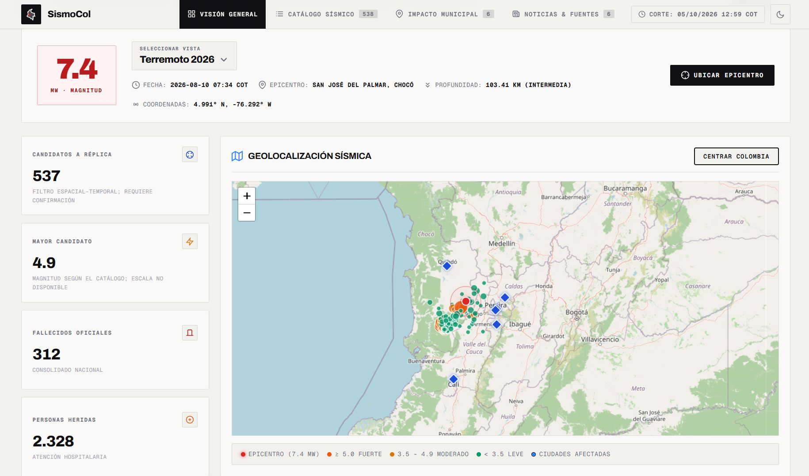

# SismoCol

Dashboard educativo para consultar y analizar la actividad sísmica de Colombia a partir del catálogo del Servicio Geológico Colombiano (SGC). Incluye una vista del sismo de Chocó del 10 de agosto de 2026, catálogo general, mapas, gráficos y datos de impacto con sus fuentes.

Las asociaciones con réplicas y enjambres son estimaciones del proyecto. No sustituyen la clasificación ni el análisis oficial del SGC.

## Vista previa




## Requisitos

- Python 3.12 recomendado.
- Acceso a internet para sincronizar el catálogo y consultar las fuentes externas.

Las dependencias de Python se encuentran en `requirements.txt` (`requests`, `pandas`, `beautifulsoup4` y `psycopg`). El mapa y los gráficos usan Leaflet y Chart.js desde CDN.

## Instalación y ejecución local

Desde la carpeta del proyecto:

```powershell
python -m venv .venv
.\.venv\Scripts\Activate.ps1
python -m pip install -r requirements.txt
python -m backend.main
```

Abre <http://127.0.0.1:8000>. En Linux o macOS, activa el entorno con `source .venv/bin/activate`.

La aplicación crea y usa por defecto `data/sismocol.sqlite3`. Para elegir otra ubicación, configura `SISMOCOL_DB` antes de iniciar el servidor.

## Comandos de datos

```powershell
python -m backend.cli sync-events              # sincroniza los últimos días del catálogo SGC
python -m backend.cli sync-events --start 2026-09-20 --end 2026-10-04
python -m backend.cli backfill                  # carga histórica del periodo de retención
python -m backend.cli reclassify                # vuelve a aplicar los criterios de asociación
python -m backend.cli cleanup --dry-run         # muestra qué datos se archivarían y eliminarían
python -m backend.cli cleanup                   # archiva y limpia datos antiguos
python -m backend.export_static --out dist      # genera el sitio estático
```

## Cómo interpreta los eventos

- **Sismo principal:** evento de referencia de la secuencia de Chocó.
- **Réplica:** evento que pasa el filtro espacial y temporal del proyecto; la coincidencia no demuestra por sí sola una relación causal.
- **Enjambre sísmico:** grupo asociado a una secuencia documentada o detectado por criterios de concentración en tiempo y espacio. Los enjambres automáticos se marcan como posibles.
- **Otro evento sísmico:** registro que no quedó asociado por esos criterios; no significa que se haya demostrado que sea independiente.

La profundidad se conserva como dato y no determina por sí sola si un evento es réplica. Las horas se procesan en UTC. Los sismos generales se conservan según los valores de `SISMOCOL_MIN_MAGNITUDE` y `SISMOCOL_RETENTION_MONTHS` (por defecto, magnitud mínima 2.5 y 24 meses).

## Estructura

- `backend/`: API, acceso a datos, sincronización, clasificación y tareas de mantenimiento.
- `frontend/`: interfaz, catálogo, mapas y gráficos.
- `schema.sql`: estructura de la base de datos.
- `data/`: base local y archivos de archivo; no se versionan.
- `.github/workflows/`: actualización automática y publicación con GitHub Pages.

## Publicación

El workflow de GitHub Actions sincroniza el catálogo, actualiza la base de datos, genera `dist/` y publica el dashboard en GitHub Pages. Para publicarlo, configura Pages con **GitHub Actions** y revisa `.github/workflows/update-data.yml`.
